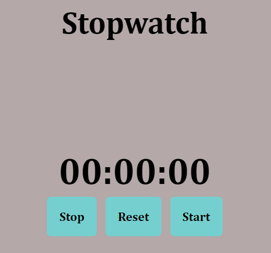

# ⏱️ Stopwatch
# DEMO 👁️ https://stopwatch-rohit.netlify.app/


This **Stopwatch** project is a simple and interactive application built with HTML, CSS, and JavaScript. It allows users to measure time in hours, minutes, and seconds with intuitive start, stop, and reset controls.

## 🌟 Features

- **Start, Stop, and Reset Controls**: Easily manage the stopwatch with three simple buttons.
- **Digital Display**: The current time is displayed in a digital format (`hh:mm:ss`).
- **Responsive Design**: The layout adapts to different screen sizes, ensuring a consistent user experience across devices.
- **Animated Button Hover Effect**: Buttons change color and size slightly on hover, providing visual feedback to users.

## 📋 How to Use

1. **Open the Webpage**: Open the `index.html` file in your browser.
2. **Start the Stopwatch**: Click the **Start** button to begin the timer.
3. **Stop the Stopwatch**: Click the **Stop** button to pause the timer.
4. **Reset the Stopwatch**: Click the **Reset** button to reset the timer back to `00:00:00`.

## 📂 Project Structure

```
📁 Stopwatch/
├── 📄 index.html
├── 📄 style.css
├── 📄 main.js
```

- **`index.html`**: Contains the HTML structure for the stopwatch and the inline JavaScript for functionality.
- **`style.css`**: Provides styling for the stopwatch's layout, buttons, and display.
- **`main.js`**: (If separated) Contains JavaScript code that handles the start, stop, and reset functionalities.

## 🎨 Styling

- **Background Color**: The stopwatch has a soft gray background to provide a neutral and calming user experience.
- **Font and Text**: The time display is large and centered, making it easy to read. The buttons have a clean, bold font and are easy to interact with.
- **Button Effects**: Buttons have a hover effect that changes their color and increases their size slightly, giving visual feedback to users.

## 💻 JavaScript Functionality

### Key Functions

1. **`start()` Function**:
   - Starts the timer by setting the `timer_isStop` flag to `false` and calling the `timer()` function.
   - Prevents multiple intervals from being created if the start button is clicked multiple times.

2. **`timer()` Function**:
   - Increments the seconds, minutes, and hours based on the elapsed time.
   - Updates the display every second (`1000 ms`).
   - Uses `setTimeout` to recursively call itself, effectively creating a timer loop.

3. **`stop()` Function**:
   - Stops the timer by setting the `timer_isStop` flag to `true`.

4. **`reset()` Function**:
   - Stops the timer and resets the seconds, minutes, and hours to zero.
   - Updates the display to show `00:00:00`.

### Example Code

```javascript
let displayTimer = document.getElementById("display-timer");
let timer_isStop = true; // Timer is initially stopped
let sec = 0;
let min = 0;
let hr = 0;

function start() {
  if (timer_isStop) {
    timer_isStop = false;
    timer();
  }
}

function timer() {
  if (!timer_isStop) {
    sec++;
    if (sec == 60) {
      min++;
      sec = 0;
    }
    if (min == 60) {
      hr++;
      min = 0;
    }

    let secString = sec < 10 ? `0${sec}` : sec;
    let minString = min < 10 ? `0${min}` : min;
    let hrString = hr < 10 ? `0${hr}` : hr;

    displayTimer.innerHTML = `${hrString}:${minString}:${secString}`;
    setTimeout(timer, 1000);
  }
}

function stop() {
  timer_isStop = true;
}

function reset() {
  timer_isStop = true;
  sec = 0;
  min = 0;
  hr = 0;
  displayTimer.innerHTML = `00:00:00`;
}
```

## 📈 Future Enhancements

- **⏰ Lap Functionality**: Add a button to record laps without resetting the stopwatch.
- **🔁 Countdown Timer**: Implement a countdown timer mode.
- **📱 Further Responsiveness**: Improve the layout for smaller devices to ensure usability on all devices.
- **🎨 Customizable Themes**: Allow users to change the color theme of the stopwatch interface.
