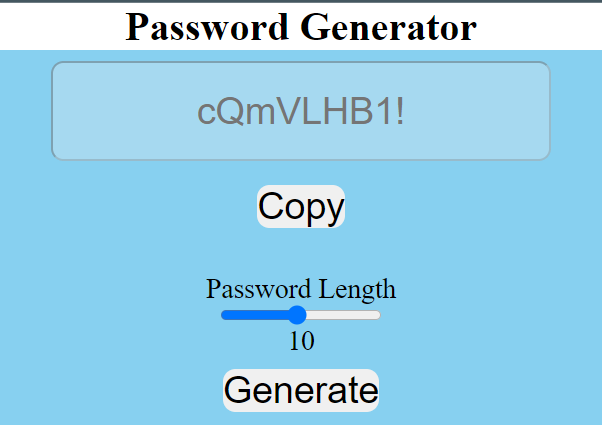

# 🔐 Password Generator
# Demo 👁️ https://password-generator-rohit.netlify.app/


The **Password Generator** is a web-based tool designed to create strong and secure passwords with customizable lengths. The user can generate random passwords and easily copy them to their clipboard.

## 🌟 Features

- **Generate Random Passwords**: The generator creates a random password with a mix of letters, numbers, and special characters.
- **Customizable Length**: Adjust the password length using a slider (from 1 to 20 characters).
- **Copy to Clipboard**: Copy the generated password to the clipboard with a single click.
- **User-Friendly Interface**: Simple and clean design for easy interaction.

## 📋 How to Use

1. **Open the Webpage**: Open the `index.html` file in your browser.
2. **Adjust Password Length**: Use the slider to select the desired password length (1 to 20 characters).
3. **Generate Password**: Click the **Generate** button to create a random password based on the selected length.
4. **Copy Password**: Click the **Copy** button to copy the generated password to your clipboard.

## 📂 Project Structure

```
📁 Password-Generator/
├── 📄 index.html
├── 📄 style.css
├── 📄 index.js
```

- **`index.html`**: Contains the HTML structure for the password generator.
- **`style.css`**: (If separated) Provides styling for the password generator's layout, buttons, and inputs.
- **`index.js`**: (If separated) Contains JavaScript code that handles the password generation, copying functionality, and event listeners for user interaction.

## 🎨 Styling

- **Background Color**: The generator has a light blue background for a calm and engaging user experience.
- **Font and Text**: The interface uses a large font size for clear visibility. The generated password and buttons are easy to interact with.
- **Button Effects**: Buttons are designed with rounded corners and hover effects to enhance the user experience.

## 💻 JavaScript Functionality

### Key Functions

1. **`generatePassword(passLength)` Function**:
   - Generates a random password of the specified length using a combination of letters, numbers, and special characters.
   - Returns the generated password.

2. **`copyPassword()` Function**:
   - Copies the generated password to the clipboard using the `navigator.clipboard.writeText` method.
   - Displays an alert to confirm that the password has been copied.

### Example Code

```javascript
let passRange = document.getElementById("passRange");
let passValue = document.getElementById("passValue");
let passField = document.getElementById("passField");
let genBtn = document.getElementById("genBtn");

passRange.addEventListener("change", function () {
  passValue.textContent = passRange.value;
});

let chars = "abcdefghijklmnopqrstuvwxyz!@#$%^&*()<>;:?ABCDEFGHIJKLMNOPQRSTUVWXYZ|-0123456789";
genBtn.addEventListener("click", function () {
  passField.value = generatePassword(passRange.value);
});

function generatePassword(passLength) {
  let password = "";
  for (let i = 0; i < passLength; i++) {
    password += chars[Math.floor(Math.random() * chars.length)];
  }
  return password;
}

function copyPassword() {
  if (passField.value != "" || passField.value >= 1) {
    navigator.clipboard.writeText(passField.value);
    alert("Password copied!");
  }
}
```

## 📈 Future Enhancements

- **🔄 Include/Exclude Characters**: Add options to include or exclude specific character types (uppercase, lowercase, numbers, symbols).
- **🔐 Password Strength Indicator**: Implement a visual indicator to show the strength of the generated password.
- **📱 Further Responsiveness**: Improve layout for smaller devices to ensure usability on all devices.
- **🎨 Customizable Themes**: Allow users to change the color theme of the generator interface.

## 📝 License

This project is open-source and available under the MIT License.

---

Feel free to adjust the README further to better suit your project details and style preferences!
