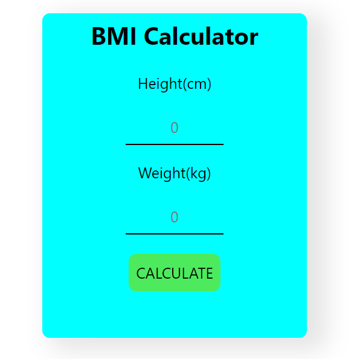

# 🧮 BMI Calculator
# DEMO 👁️ https://bmi-calculator-rohit.netlify.app/


The **BMI Calculator** is a simple web-based tool that helps users calculate their Body Mass Index (BMI) based on their height and weight. The BMI value helps to determine if an individual is underweight, normal weight, overweight, or obese.

## 🌟 Features

- **Simple Input**: Users can input their height (in centimeters) and weight (in kilograms) to calculate their BMI.
- **BMI Classification**: Displays the BMI value along with a classification (e.g., underweight, normal, overweight).
- **User-Friendly Interface**: Clean and intuitive design for easy use.
- **Error Handling**: Provides user feedback for invalid or missing inputs.

## 📋 How to Use

1. **Open the Webpage**: Open the `index.html` file in your browser.
2. **Enter Height and Weight**: Fill in your height (in centimeters) and weight (in kilograms) in the respective input fields.
3. **Calculate BMI**: Click the **Calculate** button to compute your BMI.
4. **View Result**: Your BMI value and its classification will be displayed below the button.

## 📂 Project Structure

```
📁 BMI-Calculator/
├── 📄 index.html
├── 📄 style.css
├── 📄 main.js
```

- **`index.html`**: Contains the HTML structure for the BMI calculator.
- **`style.css`**: (If separated) Provides styling for the layout, buttons, and inputs.
- **`main.js`**: (If separated) Contains JavaScript code that handles the BMI calculation and input validation.

## 🎨 Styling

- **Background Color**: The calculator has a light aqua background for a calming and easy-to-read interface.
- **Font and Text**: Uses a modern sans-serif font and clear, large text for easy readability.
- **Button Effects**: Buttons have rounded corners and hover effects to enhance the user experience.

## 💻 JavaScript Functionality

### Key Functions

1. **`CalculateBmi()` Function**:
   - Retrieves height and weight input values from the user.
   - Validates the input values to ensure they are numeric and positive.
   - Calculates the BMI using the formula:  
     \[
     \text{BMI} = \frac{\text{weight}}{(\text{height} \times \text{height}) / 10000}
     \]
   - Determines the BMI category based on the calculated BMI value.
   - Displays the BMI result and category to the user.

### Example Code

```javascript
function CalculateBmi() {
  const height = document.getElementById("heightBox").value;
  const weight = document.getElementById("weightBox").value;
  const result = document.getElementById("result");
  
  if (!height || isNaN(height) || height <= 0) {
    result.innerText = "Please provide a valid height";
    return;
  } else if (!weight || isNaN(weight) || weight <= 0) {
    result.innerText = "Please provide a valid weight";
    return;
  }

  const bmi = (weight / ((height * height) / 10000)).toFixed(2);
  
  if (bmi < 18.5) {
    result.innerText = `Underweight: Your BMI is ${bmi}`;
  } else if (bmi >= 18.5 && bmi < 24.9) {
    result.innerText = `Normal: Your BMI is ${bmi}`;
  } else if (bmi >= 25 && bmi < 29.9) {
    result.innerText = `Overweight: Your BMI is ${bmi}`;
  } else if (bmi >= 30 && bmi < 34.9) {
    result.innerText = `Obesity (Class 1): Your BMI is ${bmi}`;
  } else if (bmi >= 35 && bmi < 39.9) {
    result.innerText = `Obesity (Class 2): Your BMI is ${bmi}`;
  } else {
    result.innerText = `Extreme Obesity: Your BMI is ${bmi}`;
  }
}
```

## 📈 Future Enhancements

- **📉 BMI History**: Add functionality to store and display a history of BMI calculations for the user.
- **🔄 Reset Button**: Include a button to clear inputs and results for new calculations.
- **📱 Responsive Design**: Improve the layout for better usability on mobile devices.
- **🌍 Unit Conversion**: Allow users to switch between metric and imperial units (e.g., centimeters to inches, kilograms to pounds).

## 📝 License

This project is open-source and available under the MIT License.
