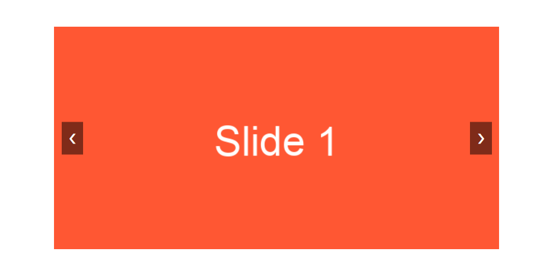

# Simple Carousel
# DEMO 👁️ https://carousel-rohit.netlify.app/


A simple image carousel implemented with HTML, CSS, and JavaScript. Users can navigate through images using "Previous" and "Next" buttons. The carousel is lightweight and easy to integrate into any website or project.

## Features

- Smooth transitions between slides
- Responsive and works well on most screen sizes
- Pure HTML, CSS, and JavaScript (no external libraries)
- Easy to customize and extend
- Supports both forward and backward navigation

## Getting Started

Follow these instructions to get a copy of the project up and running on your local machine.

### Prerequisites

You only need a modern web browser like Chrome, Firefox, or Safari.

### Installation

1. **Clone the repository**:

    ```bash
    git clone https://github.com/yourusername/simple-carousel.git
    ```

2. **Navigate to the project folder**:

    ```bash
    cd simple-carousel
    ```

3. **Open `index.html` in your browser**:

    ```bash
    open index.html
    ```

That's it! The carousel should be running in your browser.

## Usage

### HTML Structure

The carousel structure is very simple. Each image is wrapped in a container, and there are navigation buttons to slide through the images.

```html
<div class="carousel-container">
    <div class="carousel">
        
        
        
    </div>
    <button class="prev" onclick="moveSlide(-1)">&#10094;</button>
    <button class="next" onclick="moveSlide(1)">&#10095;</button>
</div>
```

### Customization

You can easily customize the carousel by:

- Replacing the placeholder images with your own.
- Adjusting the width or height of the carousel by modifying the CSS file.
- Adding more slides by inserting additional `img` elements inside the `.carousel` div.

### JavaScript Logic

The JavaScript file contains simple logic to handle slide transitions. Feel free to modify or extend the code to add features like autoplay or swipe gestures.


### Explanation of the README structure:

1. **Project Title & Description**: Explains what the project is and what features it provides.
2. **Features**: Highlights the key functionalities of the carousel.
3. **Demo**: A placeholder for adding a screenshot or gif of the working carousel.
4. **Getting Started**: Instructions on how to clone and run the project locally.
5. **Usage**: Explanation of the HTML structure, and instructions for customization.
