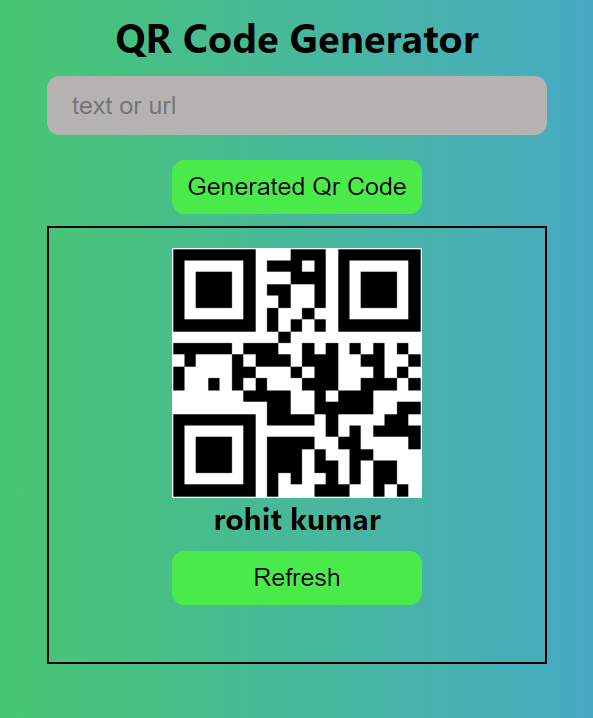

# 📱 QR Code Generator
# DEMO 👁️ https://qr-generator-rohit.netlify.app/


This project is a simple and intuitive QR Code Generator built with HTML, CSS, and JavaScript. Users can input any text or URL, and the application will generate a corresponding QR code, which can be downloaded or shared.

## 🌟 Features

- **🔠 Input Text or URL**: Enter any text or URL to generate a QR code.
- **📷 QR Code Generation**: Instantly creates a QR code for the input provided.
- **🔄 Refresh Option**: Allows you to refresh and generate a new QR code easily.

## 🛠️ Technologies Used

- **🌐 HTML**: Structure of the web page.
- **🎨 CSS**: Styling and layout of the QR code generator.
- **📝 JavaScript**: Logic for generating the QR code using an external API.

## 🚀 Getting Started

To run this project locally, follow these steps:

1. **📥 Clone the repository**:
   ```bash
   git clone https://github.com/yourusername/qr-code-generator.git
   ```
   
2. **📂 Navigate to the project directory**:
   ```bash
   cd qr-code-generator
   ```

3. **🌐 Open `index.html` in your web browser**:
   You can double-click the `index.html` file in the project directory or use a simple web server to serve the files.

## 🖥️ How to Use

1. **Open the `index.html` file** in your web browser.
2. **Enter text or URL** in the input field provided.
3. **Click the 'Generate' button**: The application will generate a QR code based on the input.
4. **View or download the QR code**: The generated QR code will be displayed below the input field.

## ✏️ Customization

- **Change QR Code Size**: You can modify the size of the QR code by altering the `size` parameter in the `imgSrc` URL inside the JavaScript code.
  
  ```javascript
  let imgSrc = `https://api.qrserver.com/v1/create-qr-code/?size=200x200&data=${inputValue}`;
  ```
  Adjust `200x200` to your preferred size.


## 📜 License

This project is open-source and available under the [MIT License](LICENSE).

