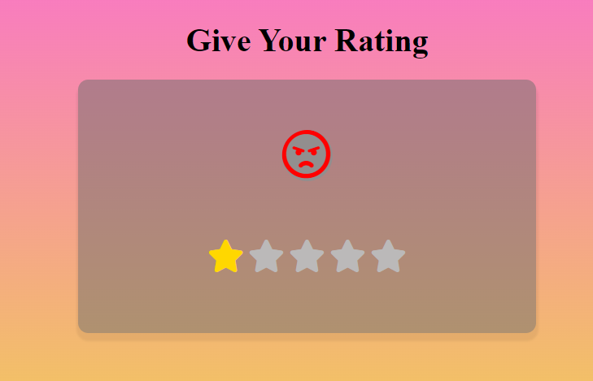

⭐⭐⭐⭐⭐# Rating System Project
# DEMO 👁️ https://star-rating-rohit.netlify.app/


This is a simple star rating system with emoji feedback, built using HTML, CSS, and JavaScript. Users can rate by selecting stars, and the corresponding emoji changes based on the rating. The project visually reflects user ratings, making it a fun and interactive way to collect feedback.

## Features

- **Star Rating**: Users can click on stars (1 to 5) to submit their rating.
- **Emoji Feedback**: The emoji dynamically changes based on the star rating selected.
  - 1 Star: Angry 😠
  - 2 Stars: Frown 😦
  - 3 Stars: Meh 😐
  - 4 Stars: Smile 😊
  - 5 Stars: Laugh 😄
- **Responsive Layout**: The application adjusts to different screen sizes.
- **Hover Effect**: Stars change color when hovered, providing a visual indicator.

## Technologies Used

- **HTML5**: Structure of the web page.
- **CSS3**: Styling for the star ratings, emojis, and layout.
- **JavaScript (Vanilla)**: Logic for handling rating selections and updating the interface.
- **FontAwesome**: For the icons representing the stars and emojis.

## How to Use

1. Clone the repository to your local machine:
   ```bash
   git clone https://github.com/yourusername/rating-system.git
   ```
2. Navigate to the project directory:
   ```bash
   cd rating-system
   ```
3. Open the `index.html` file in your browser:
   ```bash
   open index.html
   ```

Once opened, you can click on the stars to select your rating, and the corresponding emoji will update based on the number of stars selected.

## Folder Structure

```bash
.
├── index.html    # Main HTML structure
├── index.js      # JavaScript for star rating and emoji interaction
└── style.css     # Styling for the project (optional if separate CSS)

## Customization

- **Add more emojis**: You can easily add more emoji states by adding new icons to the `.emoji-box` and modifying the JavaScript logic.
- **Change star styles**: Customize the star appearance (size, color) by modifying the CSS.
