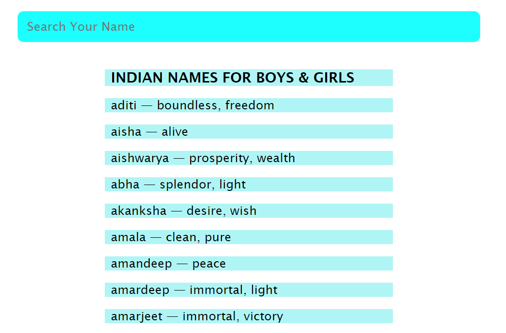

# 🔍 Indian Names Search Bar Functionality
# DEMO 👁️ https://search-functionality-rohit.netlify.app/


## Table of Contents
- [Overview](#overview)
- [Features](#features)
- [Technologies Used](#technologies-used)
- [How to Use](#how-to-use)
- [Screenshots](#screenshots)
- [Installation](#installation)
- [Project Structure](#project-structure)

## Overview
This project demonstrates a simple search bar functionality that allows users to search Indian names for boys and girls from a predefined list. The list of names is dynamically filtered as the user types into the search bar.

## Features
- **Dynamic search**: As the user types into the search bar, the list of names gets filtered in real-time.
- **Clear UI**: Simple and elegant design for displaying the list of names.
- **Responsive Design**: The layout adjusts according to the screen size for optimal viewing on different devices.

## Technologies Used
- **HTML**: Structure of the webpage.
- **CSS**: Styling the search bar and name list.
- **JavaScript**: Adding the functionality to filter names dynamically.

## How to Use
1. Clone or download the repository to your local machine.
2. Open the `index.html` file in your browser.
3. Start typing a name in the search bar. The list below will automatically filter the names based on your input.

## Screenshots


## Installation
1. **Clone the repository**:
   ```bash
   git clone https://github.com/yourusername/indian-names-search-bar.git
   ```
2. **Navigate to the project directory**:
   ```bash
   cd indian-names-search-bar
   ```
3. Open `index.html` in your browser.

## Project Structure
```bash
|-- index.html
|-- style.css (if external styles are used)
|-- index.js (if external JS is used)
|-- README.md
|-- /search.png
