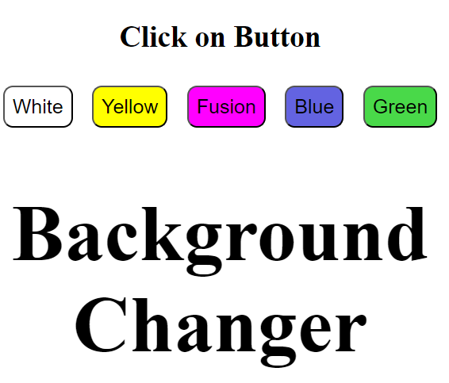

# 🌈 Background Color Changer
#DEMO https://background-color-changer-rohit.netlify.app/


Welcome to the **Background Color Changer** project! This simple project allows users to change the background color of the webpage by clicking different buttons. It's a great example of how to use JavaScript for DOM manipulation to enhance user interaction.

## 🚀 Features

- **🎨 Easy Color Switching**: Click on a button to instantly change the background color.
- **🖱️ User-Friendly Interface**: Simple buttons with color labels make it intuitive for users.
- **🎯 Lightweight and Responsive**: The application is built using HTML, CSS, and JavaScript with minimal code, ensuring quick loading and responsiveness on all devices.
- **🔄 Dynamic Changes**: The background color changes dynamically with no need to refresh the page.

## 📋 How to Use

1. **Open the webpage** in your favorite browser.
2. **Click** on any of the color buttons:
   - 🟦 **Blue**
   - 🟨 **Yellow**
   - 🟩 **Green**
   - 🟪 **Fusion**
   - ⚪ **White**

3. Watch the background color change instantly!

## 📂 Project Structure

```
📁 Background-Color-Changer/
├── 📄 index.html
├── 📄 style.css
└── 📄 main.js
```

- **index.html**: Contains the HTML structure of the webpage.
- **style.css**: Contains CSS styles for the buttons and text.
- **main.js**: Contains JavaScript code for handling the background color changes.

## 🌟 Highlights

- **Simple and Clean Code**: Perfect for beginners to understand basic JavaScript functions and event handling.
- **Customizable**: Easily add more colors or modify the design according to your needs.
- **Interactive Learning**: A great hands-on project to learn DOM manipulation and event handling in JavaScript.

## 🤖 How it Works

When a user clicks on one of the buttons, a JavaScript function is triggered to change the background color of the webpage. This function uses the `onclick` event handler to dynamically update the `backgroundColor` property of the `document.body` element.

## 💡 Future Improvements

- 🎨 **Add More Colors**: Include more color options for users to choose from.
- 🌈 **Color Picker**: Allow users to select any color using a color picker tool.
- 🔄 **Reset Button**: Add a button to reset the background color to default.

## 📝 License

This project is open-source and free to use.

---

Feel free to adjust the README file according to your preferences or add more details if needed!
