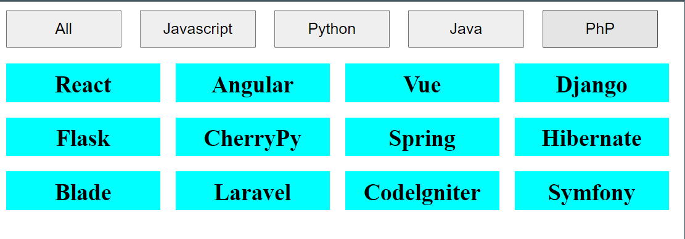

# Filter Gallery
# DEMO 👁️ https://filter-gallery-rohit.netlify.app/



## Table of Contents
- [Overview](#overview)
- [Features](#features)
- [Technologies Used](#technologies-used)
- [How to Use](#how-to-use)
- [Installation](#installation)
- [Project Structure](#project-structure)

## Overview
This project is a filterable gallery that allows users to filter different items (technologies in this case) based on categories like JavaScript, Python, Java, and PHP. The gallery will dynamically display or hide items depending on the filter selected.

## Features
- **Dynamic filtering**: Filter items based on their category with a button click.
- **Flexbox layout**: Items are displayed in a flexible grid that wraps around for responsive design.
- **Clean and simple design**: A minimalistic interface for ease of use.

## Technologies Used
- **HTML**: For structuring the page.
- **CSS**: For styling the buttons, gallery, and layout.
- **JavaScript**: For adding interactivity and filtering functionality.

## How to Use
1. Clone or download this repository to your local machine.
2. Open the `index.html` file in your browser.
3. Click the buttons to filter the gallery based on technology type.

- **All**: Displays all items.
- **JavaScript**: Filters items related to JavaScript technologies.
- **Python**: Filters items related to Python technologies.
- **Java**: Filters items related to Java technologies.
- **PHP**: Filters items related to PHP technologies.

## Screenshots


## Installation
1. **Clone the repository**:
   ```bash
   git clone https://github.com/yourusername/filter-gallery.git
   ```
2. **Navigate to the project directory**:
   ```bash
   cd filter-gallery
   ```
3. Open `index.html` in your preferred browser.

## Project Structure
```bash
|-- index.html
|-- style.css (if external styles are used)
|-- index.js (if external JS is used)
|-- README.md
