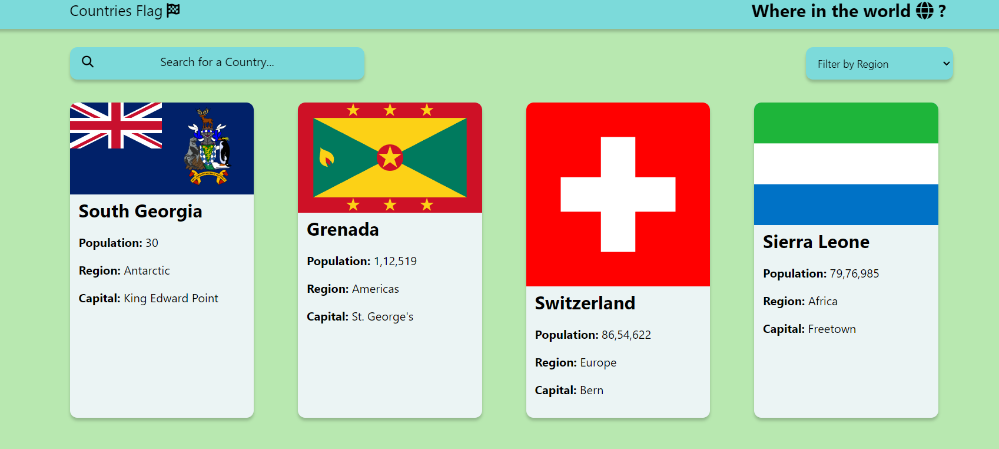

# Countries Flag 🌍🏁
# DEMO 👁️  https://countries-flag-rohit1.netlify.app/


A simple and interactive web application that allows users to explore and search for country information by filtering regions and searching by country name. The app displays the country flags, population, region, and capital for each country.

## Features

- 🌐 **Fetch Country Data**: Retrieves country data from the REST Countries API.
- 🔍 **Search Functionality**: Users can search for a country by name.
- 🌎 **Region Filter**: Users can filter countries by region (Africa, America, Asia, Europe, Oceania).
- 🎨 **Responsive Design**: The layout adjusts seamlessly across different screen sizes.
- 🌑 **Dark Mode**: Option to switch between light and dark themes (Note: Dark mode feature is designed but not yet implemented).

## Technologies Used

- **HTML5**: Markup language for structuring the web page.
- **CSS3**: Styling for the visual presentation of the app.
- **JavaScript (ES6)**: Programming language to add interactivity and fetch data from the API.
- **REST Countries API**: Provides information about countries (flags, population, region, etc.).
- **Font Awesome**: Icon library used for search and other icons.

## Installation

No installation is required. You can directly clone or download the project and open the `index.html` file in your browser.

```bash
git clone https://github.com/your-username/countries-flag.git
```

## Usage

1. Open `index.html` in your browser.
2. Use the search bar to search for a specific country.
3. Use the filter dropdown to filter countries by region.
4. The app will display a list of countries with their flags, population, region, and capital.

## Future Improvements

- Implement dark mode functionality.
- Improve the loading experience with a custom loader.
- Add more detailed country information on clicking a country card.

## Contributing

Contributions are welcome! Feel free to open an issue or submit a pull request for any improvements or features you'd like to see.

## License

This project is open-source and available under the [MIT License](LICENSE).

## Acknowledgements

- [REST Countries API](https://restcountries.com/) for providing the country data.
- [Font Awesome](https://fontawesome.com/) for the icons used in the project.

---

_This project was created as a learning exercise to enhance my skills in web development, particularly in working with APIs and responsive design._
```

This README file provides a comprehensive overview of your project, including its features, technologies used, installation instructions, and more. Adjust the content as needed to better fit your project's specifics.
