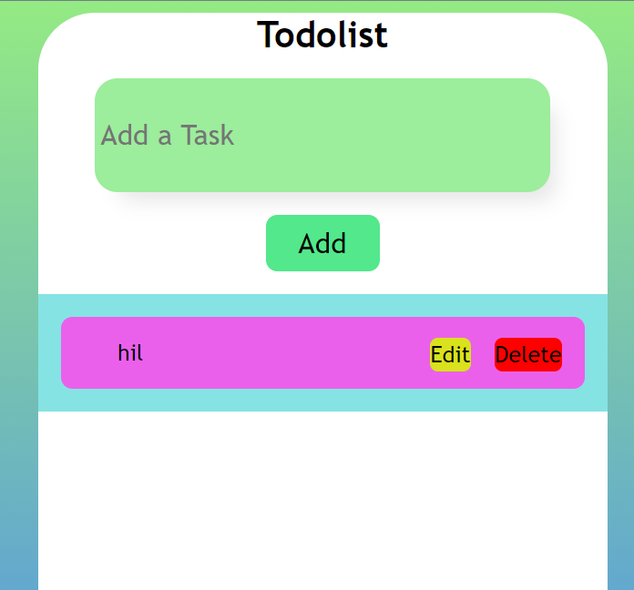

# Todo List Application
# DEMO 👁️ https://todolist-rohitg.netlify.app/


A simple and interactive Todo List application built using HTML, CSS, and JavaScript. This app allows users to add, edit, and delete tasks, with persistent storage using the browser's `localStorage` to save tasks even after refreshing the page.

## Features

- **Add Tasks**: Users can add tasks by typing in the input box and clicking the "Add" button.
- **Edit Tasks**: Tasks can be edited by clicking the "Edit" button next to the task.
- **Delete Tasks**: Tasks can be deleted by clicking the "Delete" button.
- **Persistent Storage**: The tasks are saved in `localStorage`, so they remain even after the page is refreshed.

## Technologies Used

- **HTML**: For structuring the application.
- **CSS**: For styling the application, including the use of gradients and responsive design.
- **JavaScript**: For the core functionality of the application, including task management and interaction with `localStorage`.

## Project Structure

- **index.html**: The main HTML file containing the structure of the Todo List app.
- **style.css** (optional): This can be used if you decide to separate the styles from the HTML file.
- **main.js**: The JavaScript file that contains the logic for adding, editing, deleting tasks, and managing the `localStorage`.

## How to Use

1. **Add a Task**: Type your task in the input box and click the "Add" button.
2. **Edit a Task**: Click the "Edit" button next to a task, make changes in the input box, and the task will be updated.
3. **Delete a Task**: Click the "Delete" button next to a task to remove it from the list.
4. **Persistent Storage**: Your tasks are automatically saved and will appear when you revisit or refresh the page.

## Code Snippet

Here's a snippet of the JavaScript code that handles adding a new task:

```javascript
function addTodo() {
    let box = document.getElementById("box");
    let inputText = box.value;
    if (inputText == "") {
        alert("write something in input field");
        return false;
    }

    const li = document.createElement("li");
    const p = document.createElement("p");
    p.innerHTML = inputText;
    p.classList.add("text");
    li.appendChild(p);

    const EditBtn = document.createElement("button");
    EditBtn.innerText = "Edit";
    EditBtn.classList.add("edit");
    li.appendChild(EditBtn);

    const deleteBtn = document.createElement("button");
    deleteBtn.innerText = "Delete";
    deleteBtn.classList.add("delete");
    li.appendChild(deleteBtn);
    let listItem = document.getElementById("listItem");
    listItem.appendChild(li);

    box.value = "";
    saveLocalTodo(inputText);
}
```

## Future Improvements

- **Task Completion**: Add functionality to mark tasks as completed.
- **Task Filtering**: Add options to filter tasks (e.g., show all, only completed, only pending).
- **Drag-and-Drop**: Implement drag-and-drop functionality to reorder tasks.

## License

This project is open-source and available under the [MIT License](LICENSE).
