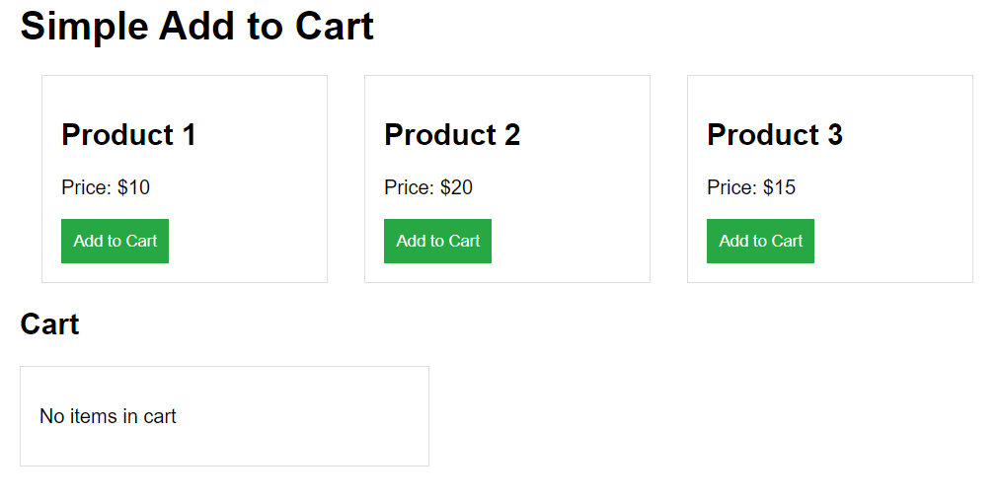

# Simple Add to Cart
# DEMO 👁️ https://addtocart-rohit.netlify.app/

A basic Add to Cart functionality built using **HTML**, **CSS**, and **JavaScript**. This project demonstrates how to add items to a shopping cart, display the selected products, and calculate the total cost.

## Features
- Displays a list of products with prices.
- "Add to Cart" buttons to add items to the cart.
- Dynamic cart display showing product names and prices.
- Total cart amount calculation.
- Simple and clean UI.

## Project Structure
- **index.html**: The main HTML file containing the product layout and cart section.
- **style.css**: Styles for the product display and cart.
- **script.js**: JavaScript functionality for adding products to the cart and updating the cart dynamically.

## How It Works
1. Users can click on the "Add to Cart" button next to each product.
2. The selected product will appear in the cart with its name and price.
3. The total amount will be updated as more products are added to the cart.
4. If no products are in the cart, a message "No items in cart" will be displayed.

## Files
- **index.html**: Contains the product list and the cart section.
- **style.css**: Provides basic styling for the product grid and the cart.
- **script.js**: Handles the logic for adding items to the cart and calculating the total price.

## Getting Started

### Prerequisites
- A web browser to view the HTML file.

### How to Run
1. Clone or download the repository.
2. Open the `index.html` file in your browser.
3. Click on the "Add to Cart" buttons to start adding products to the cart.

## Technologies Used
- **HTML**: For structuring the content.
- **CSS**: For styling the product list and cart.
- **JavaScript**: For adding interactivity and handling the cart functionality.
