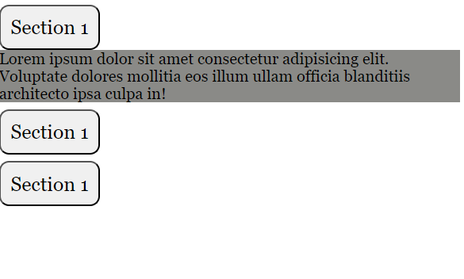

# Accordion Project
# DEMO 👁️ https://accordion-rohit.netlify.app/


## Table of Contents
- [Overview](#overview)
- [Features](#features)
- [Technologies Used](#technologies-used)
- [How to Use](#how-to-use)
- [Installation](#installation)
- [Project Structure](#project-structure)

## Overview
This project is a simple accordion component that expands or collapses sections to display or hide content. The accordion sections are hidden by default and expand when clicked, allowing users to view additional information.

## Features
- **Accordion functionality**: Allows users to expand or collapse different sections.
- **Smooth transitions**: Animates the expanding/collapsing of sections.
- **Responsive design**: Works well on different screen sizes.

## Technologies Used
- **HTML**: For structuring the page content.
- **CSS**: For styling the accordion and providing smooth transitions.
- **JavaScript**: For adding interactivity to expand and collapse sections.

## How to Use
1. Clone or download this repository to your local machine.
2. Open the `index.html` file in your browser.
3. Click on any section to expand it and view the content. Click again to collapse it.

## Installation
1. **Clone the repository**:
   ```bash
   git clone https://github.com/yourusername/accordion.git
   ```
2. **Navigate to the project directory**:
   ```bash
   cd accordion
   ```
3. Open `index.html` in your preferred browser.

## Project Structure
```bash
|-- index.html
|-- index.js
|-- README.md
|-- /screenshots (add screenshots of the project here)
```
