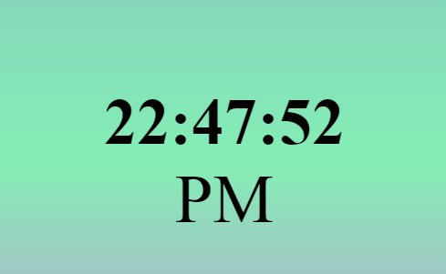

# 🕰️ Digital Clock
# DEMO 👁️ https://digital-clock-rohit.netlify.app/


The **Digital Clock** is a simple web-based application that displays the current time in hours, minutes, and seconds, along with the AM/PM format. It automatically updates every second to reflect the current local time.

## 🌟 Features

- **Real-Time Clock**: Displays the current time in `HH:MM:SS` format.
- **AM/PM Format**: Shows whether the time is AM or PM.
- **Auto Update**: The time is automatically updated every second.

## 📋 How to Use

1. **Open the Webpage**: Open the `index.html` file in your browser.
2. **View the Time**: The current local time will be displayed in the center of the page with an AM/PM indicator.

## 📂 Project Structure

```
📁 Digital-Clock/
├── 📄 index.html
├── 📄 style.css
└── 📄 main.js
```

- **`index.html`**: Contains the HTML structure for the digital clock.
- **`style.css`**: Provides the styling for the clock (although the CSS in this example is inline, you might have an external CSS file if needed).
- **`main.js`**: Handles the JavaScript functionality for displaying and updating the time.

## 🎨 Styling

- The background uses a **linear gradient** for a visually appealing transition of colors.
- The clock is centered on the page using **Flexbox** to ensure it is positioned perfectly regardless of screen size.

## 💻 JavaScript Functionality

Here’s a breakdown of the JavaScript code used in this project:

1. **`showTime()` Function**:
   - Gets the current date and time using the `Date` object.
   - Extracts the hours, minutes, and seconds.
   - Formats each time component to ensure double digits (e.g., `05` instead of `5`).
   - Updates the `innerHTML` of the time and format elements to reflect the current time and AM/PM status.

2. **Automatic Time Update**:
   - The `setInterval()` function calls `showTime()` every 1000 milliseconds (1 second) to refresh the displayed time.

```javascript
let time = document.getElementById("time");
let format = document.getElementById("format");

document.addEventListener("DOMContentLoaded", () => {
  setInterval(showTime, 1000);
});

const showTime = () => {
  let date = new Date();
  let hr = date.getHours();
  let min = date.getMinutes();
  let sec = date.getSeconds();
  hr = hr < 10 ? `0${hr}` : hr;
  min = min < 10 ? `0${min}` : min;
  sec = sec < 10 ? `0${sec}` : sec;
  time.innerHTML = `${hr}:${min}:${sec}`;
  format.innerHTML = hr >= 12 ? "PM" : "AM";
};
```

## 📈 Future Enhancements

- **⏰ Alarm Feature**: Add functionality to set alarms.
- **🌐 Time Zone Selection**: Allow users to select and view different time zones.
- **🌓 Dark/Light Mode**: Add a toggle switch to switch between dark and light themes.

## 🎉 Contributions

Contributions are welcome! Feel free to submit a pull request or open an issue.

## 📝 License

This project is open-source 
