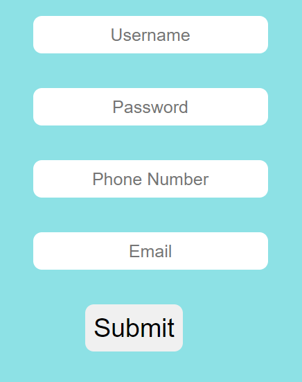

# 📝 Form Validation
# DEMO 👁️ https://form-validation-rohit.netlify.app/


This **Form Validation** project is a simple HTML and JavaScript-based form that validates user input in real-time. The form includes fields for a username, password, phone number, and email, and provides immediate feedback on the validity of the input.

## 🌟 Features

- **Real-Time Validation**: Provides immediate feedback on each input field as the user types.
- **Error Messages**: Displays error messages for invalid inputs, such as a username or password that is too short or an incorrectly formatted phone number or email.
- **Visual Cues**: Changes the border color of input fields to red for errors and green for valid inputs.
- **Responsive Design**: Adjusts the form layout for different screen sizes.

## 📋 How to Use

1. **Open the Webpage**: Open the `index.html` file in your browser.
2. **Enter Details**: Fill in the form fields (username, password, phone number, email).
3. **Submit the Form**: Click the "Submit" button. The form will only submit if all fields are valid.

## 📂 Project Structure

```
📁 Form-Validation/
├── 📄 index.html
├── 📄 style.css
└── 📄 main.js
```

- **`index.html`**: Contains the HTML structure for the form and inline JavaScript for validation.
- **`style.css`**: (If used) Provides the styling for the form fields and layout.
- **`main.js`**: (If separated) Handles the JavaScript functionality for form validation (currently inline within `index.html`).

## 🎨 Styling

- The form is centered on the page with a background color of **rgb(141, 225, 229)**.
- Input fields and error messages are styled to provide a user-friendly experience.
- Media queries ensure the form is responsive and adjusts layout on smaller screens.

## 💻 JavaScript Functionality

### Validation Functions

1. **`validForm()` Function**:
   - Calls all the individual validation functions (`userValid()`, `passValid()`, `telValid()`, `emailValid()`).
   - Sets the `flag` variable to `0` or `1` based on the input validity. The form submission is prevented if any input is invalid.

2. **`userValid()` Function**:
   - Checks if the username is at least 5 characters long.
   - Displays an error message and changes the input border color to red if invalid, otherwise green if valid.

3. **`passValid()` Function**:
   - Validates the password length (at least 5 characters).
   - Provides similar feedback as the `userValid()` function.

4. **`telValid()` Function**:
   - Checks if the phone number is exactly 10 digits.
   - Displays a message and changes the input field's border color based on validity.

5. **`emailValid()` Function**:
   - Validates the email length (minimum 5 characters).
   - Changes the border color and displays feedback based on input validity.

### Example Code

```javascript
function validForm() {
  userValid();
  passValid();
  telValid();
  emailValid();

  email.value.length == "" ||
  pass.value.length == "" ||
  tel.value.length == "" ||
  user.value.length == ""
    ? (flag = 0)
    : (flag = 1);

  return flag ? true : false;
}
```

## 📈 Future Enhancements

- **🔒 Stronger Password Validation**: Add checks for special characters, numbers, and uppercase letters.
- **📧 Enhanced Email Validation**: Improve email validation to check for proper email format using regular expressions.
- **🌐 Server-Side Validation**: Add server-side validation to enhance security.

## 🎉 Contributions

Contributions are welcome! Feel free to submit a pull request or open an issue.

## 📝 License

This project is open-source 

Feel free to modify the content to better fit your project or personal preferences!
