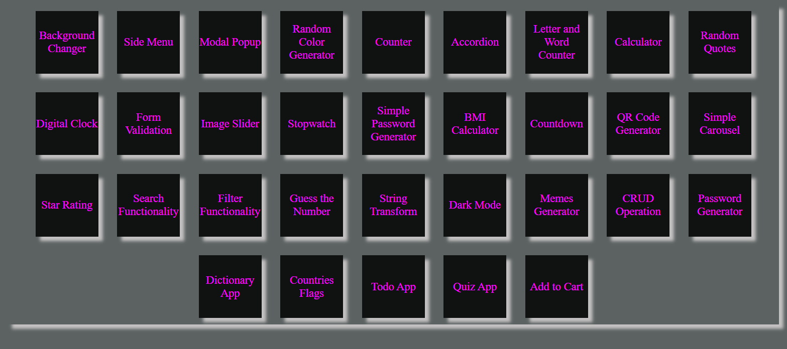

# 🌟 JavaScript Projects Repository
# DEMO 👁️ https://30-javascript-projects-rohit.netlify.app/

# Owner - Rohit Kumar

Welcome to my **JavaScript Projects** repository! This collection showcases various projects built using **Vanilla JavaScript** 🛠️, starting from basic to intermediate levels. Each project represents a milestone in my learning journey, and I'm thrilled to share the knowledge and skills I've acquired along the way.
Certainly! Here's a README file for your repository along with a table listing your projects and their live demos.

---

## 30 JavaScript Projects

This repository contains a collection of 30 JavaScript projects that showcase various web development skills and techniques. Each project demonstrates a different functionality or feature, providing a comprehensive overview of what can be achieved with JavaScript, HTML, and CSS.

### Projects List

Below is a table of the projects included in this repository along with links to their live demos.

| Project Name                     | Live Demo URL                                              |
|---------------------------------|------------------------------------------------------------|
| Background Changer               | [View Demo](https://background-color-changer-rohit.netlify.app/) |
| Side Menu                        | [View Demo](https://side-menu-rohit.netlify.app/)            |
| Modal Popup                      | [View Demo](https://modal-popup-rohit.netlify.app/)          |
| Random Color Generator           | [View Demo](https://random-color-generator-rohit.netlify.app/) |
| Counter                          | [View Demo](https://counter-rohit.netlify.app/)              |
| Accordion                        | [View Demo](https://accordion-rohit.netlify.app/)            |
| Letter and Word Counter          | [View Demo](https://word-counter-rohit.netlify.app/)         |
| Calculator                       | [View Demo](https://calculator1-rohit.netlify.app/)          |
| Random Quotes                    | [View Demo](https://random-qoute-generator-rohit.netlify.app/) |
| Digital Clock                    | [View Demo](https://digital-clock-rohit.netlify.app/)        |
| Form Validation                  | [View Demo](https://form-validation-rohit.netlify.app/)      |
| Image Slider                     | [View Demo](https://image-slider-rohit.netlify.app/)         |
| Stopwatch                        | [View Demo](https://stopwatch-rohit.netlify.app/)            |
| Simple Password Generator        | [View Demo](https://password-generator-rohit.netlify.app/)   |
| BMI Calculator                   | [View Demo](https://bmi-calculator-rohit.netlify.app/)       |
| Countdown                        | [View Demo](https://countdown-rohit.netlify.app/)            |
| QR Code Generator                | [View Demo](https://qr-generator-rohit.netlify.app/)         |
| Simple Carousel                  | [View Demo](https://carousel-rohit.netlify.app/)             |
| Star Rating                      | [View Demo](https://star-rating-rohit.netlify.app/)          |
| Search Functionality             | [View Demo](https://search-functionality-rohit.netlify.app/) |
| Filter Functionality             | [View Demo](https://filter-gallery-rohit.netlify.app/)       |
| Guess the Number                 | [View Demo](https://guess-the-number-rohit.netlify.app/)     |
| String Transform                 | [View Demo](https://string-transformer-rohit.netlify.app/)   |
| Dark Mode                        | [View Demo](https://darkmode-local-rohit.netlify.app/)       |
| Memes Generator                  | [View Demo](https://memes-generator-rohit.netlify.app/)      |
| CRUD Operation                   | [View Demo](https://crud-local-rohit.netlify.app/)           |
| Password Generator with Inputs   | [View Demo](https://password-generator-with-inputs-rohit.netlify.app/) |
| Dictionary App                   | [View Demo](https://dictionary-app-rohit.netlify.app/)       |
| Countries Flags                  | [View Demo](https://countries-flag-rohit1.netlify.app/)      |
| Todo App                         | [View Demo](https://todolist-rohitg.netlify.app/)            |
| Quiz App                         | [View Demo](https://quizz-app-rohit.netlify.app/)            |
| Add to Cart                      | [View Demo](https://addtocart-rohit.netlify.app/)            |


## 📂 Project Categories

- 🥉 **Basic Level Projects**: Getting started with fundamental JavaScript concepts and simple applications.
- 🥈 **Intermediate Level Projects**: Diving deeper into more complex logic, DOM manipulation, and event handling.

## 📚 What I Learned

Through these projects, I've gained hands-on experience with:
- **DOM Manipulation** 🖼️
- **Event Handling** 🎯
- **API Integration** 🌐
- **Asynchronous JavaScript** ⏳
- **Advanced Array Methods** 🔄
- **JavaScript Design Patterns** 🧩
- And much more...

Each project has pushed me to explore new concepts and solve problems in innovative ways. I'm excited to continue this journey and keep improving my skills.

## 🚀 How to Use This Repository

Feel free to explore the projects by navigating through the directories. Each project comes with its own `README.md` file that explains the project's objective, the concepts it covers, and instructions on how to run it.

## 🛠️ Running the Projects

To run any project locally:

1. Clone the repository:
   ```bash
   git clone https://github.com/raizocoder/javascript-projects.git
   ```
2. Navigate to the project folder:
   ```bash
   cd javascript-projects/project-folder
   ```
3. Open the `index.html` file in your browser.

## 📧 Contact

If you have any questions or just want to connect, feel free to reach out to me via email ronykumar4@@gmail.com

---

🌟 **Thank you for visiting!** I'm constantly learning and growing, and I hope these projects inspire you as much as they've inspired me. Happy coding! 🚀


